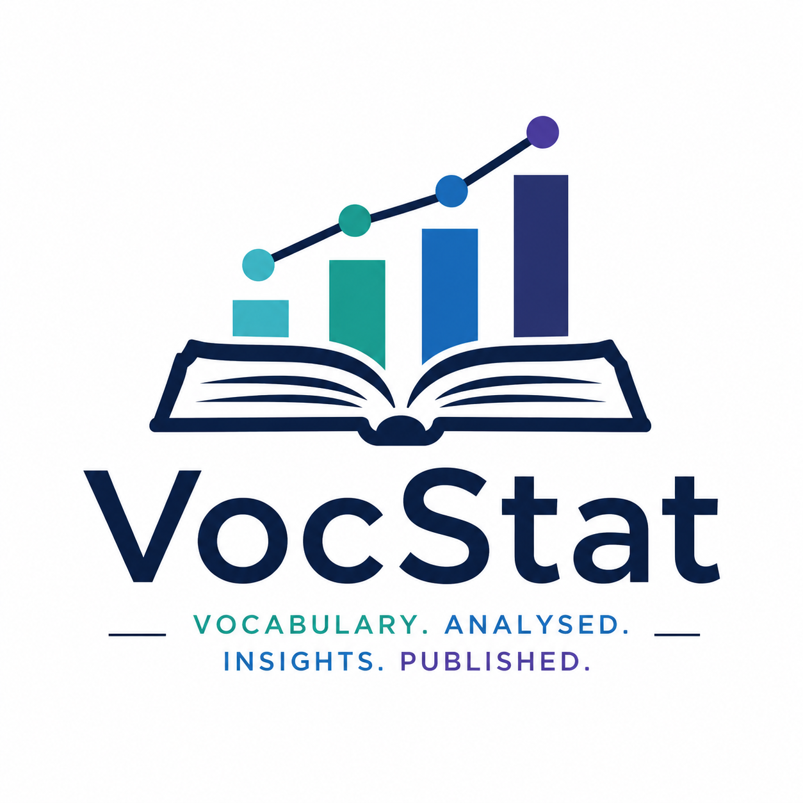

# VocStat

<p align="center">
  
</p>

Vocabulary Statistics: an informational SHACL profile, validator, specification,
and application toolkit for understanding semantic vocabularies.

VocStat treats SHACL as an information model rather than only a constraint
language. Its first target is SKOS vocabularies, with all SKOS terms accounted
for and with thesaurus-construction standards as the evidence base.

## Purpose

VocStat should help vocabulary owners answer generous questions about a
semantic vocabulary:

- How many concepts, concept schemes, collections, labels, notes, mappings, and
  relationships exist?
- Which SKOS features are used, unused, or unusually concentrated?
- What is the hierarchy geometry: shallow, deep, top-heavy, balanced,
  lop-sided, broad, narrow, or fragmented?
- How navigable is it, e.g. what percentage of concepts are in the top five hierarchy levels?
- Which observations are informational, advisory, or quality-significant?

## Standards Spine

The primary thesaurus standards to anchor VocStat are:

- ANSI/NISO Z39.19-2005 (R2010), *Guidelines for the Construction, Format, and
  Management of Monolingual Controlled Vocabularies*.
- ISO 25964-1:2011, *Thesauri and interoperability with other vocabularies -
  Part 1: Thesauri for information retrieval*.
- ISO 25964-2:2013, *Thesauri and interoperability with other vocabularies -
  Part 2: Interoperability with other vocabularies*.
- W3C SKOS Reference, a W3C Recommendation.

See [docs/standards-and-literature.md](docs/standards-and-literature.md) for
links, access notes, and candidate secondary literature.

## Repository Layout

```text
docs/
  assets/logo.png                 VocStat logo for README and project surfaces
  spec-outline.md                 Draft shape of the VocStat specification
  standards-and-literature.md     Source register and acquisition notes
examples/
  tiny-skos.ttl                   Small SKOS vocabulary for smoke testing
shapes/
  vocstat-skos-info.ttl           Informational SHACL seed shapes
src/vocstat/
  cli.py                          Command-line entry point
  stats.py                        SKOS statistics and hierarchy geometry
tests/
  test_stats.py                   Unit tests for the first statistics layer
```

## Quick Start

```bash
python -m venv .venv
source .venv/bin/activate
pip install -e ".[dev]"
vocstat stats examples/tiny-skos.ttl
pytest
```

## Current Status

This is a starting point. The repo currently contains:

- a first pass at the standards/literature register;
- an outline for the future specification;
- informational SHACL shapes using `sh:Info`;
- a minimal statistics engine for SKOS concept counts, label counts, hierarchy
  depth, and simple geometry classification.

## Feedback

VocStat is a personal project in active development, but thoughtful feedback is
welcome. If you find an error, have a source to suggest, or want to discuss a
possible statistic or SHACL observation, please raise an issue.

See [CONTRIBUTING.md](CONTRIBUTING.md) for the current contribution approach.
